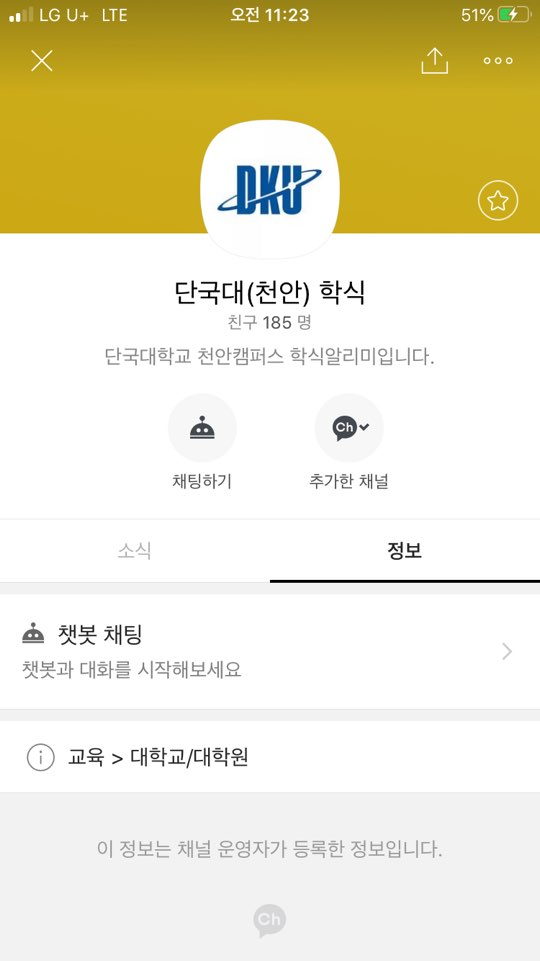

# DKU Cafeteria Chat Bot

## Project Summary

기존 학교 어플은 학식 정보를 얻기 위해서 여러 페이지를 거쳐서 접근을 해야했기 때문에 접근성이 낮았습니다. 따라서 접근성이 높은 카카오톡 챗봇 API를 활용하여 정보의 접근성을 높였습니다.

## How to use

카카오톡 검색창에 **'단국대(천안) 학식'** 라고 검색한 뒤, 친구 추가 후 사용하시면 됩니다.

## User Interface

단국대학교 내 세 개의 식당(학생식당, 기숙사식당, 교직원식당)에 해당 하는 버튼들로 인터페이스를 구성하였습니다.

## Example

해당 식당의 버튼을 누르면 메뉴 정보를 받을 수 있습니다.

학식 메뉴가 존재하지 않을 경우에도 응답을 합니다.

메뉴 정보는 단국대학교 웹 페이지를 크롤링해서 재가공하여 사용합니다.

## 공지사항

### 2020.08.25

현재 코로나 확산으로 인해 학식 이용률이 낮아짐에 따라서 학식 정보 챗봇의 이용률 또한 낮아지고 있습니다. 따라서 크레딧 사용의 최소화를 위해서 30분동안 요청이 없으면 Sleep 모드로 들어가도록 했습니다.

다시 요청을 보내면 정상적으로 작동하지만 서버가 다시 시작되는데 시간이 약간(5초 ~ 10초) 필요합니다. 따라서 아무런 응답 메세지가 없어도 서버가 다시 실행되기까지 잠시만 기다려주시면 감사드리겠습니다

감사합니다.

개발자 : 장서원
